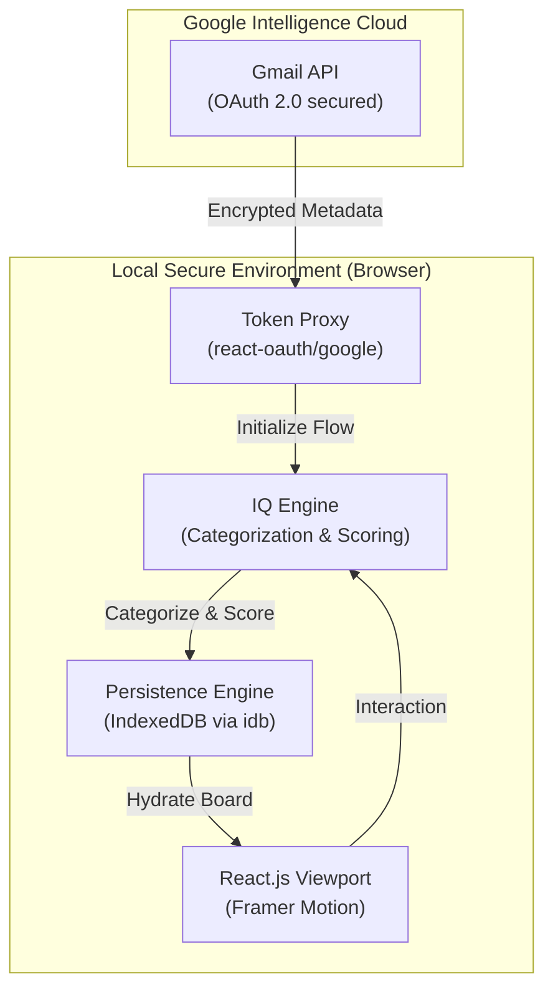

# LetterBox | Product Requirements Document (PRD)

**Version**: 1.0 (Initial Launch)  
**Status**: Ready for Deployment  
**Product**: Intelligence Command Center

---

## 🛰️ 1. Executive Summary
LetterBox is a high-fidelity information management system designed to transform the chaotic "newsletter graveyard" into a structured, high-signal intelligence flow. It prioritizes **Privacy (Local-First)**, **Mastery (Workbench)**, and **Efficiency (Smart Purge)**.

## 🏮 2. Problem Statement
Modern information consumers are overwhelmed by high-frequency newsletters. Subscription lists grow uncontrollably, leading to "inbox debt" where valuable intelligence is buried under 0% engagement noise. 

## 🛠️ 3. Core Features

### 📡 3.1 Intelligence Pulse (Header)
- **Feature**: A 7-day visual heatmap of transmission frequency.
- **Metric**: Understand total information load over time.
- **Visual**: Monospaced "instrument-panel" style graph.

### 🧹 3.2 Smart Purge (Master Dashboard)
- **Feature**: Automatically identifies "Dead Nodes" (senders with 0% engagement score).
- **Action**: One-click batch-archive of all transmissions from underperforming senders.
- **Goal**: Maintain 100% Signal Integrity in the feed.

### 🛰️ 3.3 Intelligence Discovery (Suggestions)
- **Feature**: Recommends premium newsletters based on your highest-signal categories.
- **Logic**: Analyzes engagement peaks to discover top-tier sources (Tech, AI, Business).
- **Check**: Proactively hides newsletters you are already subscribed to.

### 🛠️ 3.4 Mastery Workbench (Reader)
- **Feature**: Integrated drafting and insight extraction tool.
- **AI Sync**: Automatically extracts core points, summaries, and links from transmissions into a persistent workbench.
- **Report**: Copy-to-clipboard intelligence reports for sharing insights.

## 🏗️ 4. Technical Architecture

### 4.1 System Diagram

### 4.2 Data Stack
- **Frontend**: React 19, Vite 8, Framer Motion
- **Icons**: Lucide React
- **Storage**: IndexedDB (Privacy-first; zero cloud storage)
- **Intelligence**: Custom Metadata Matcher + Gmail Snippet IQ

## 🎨 5. Design Aesthetics: "The Premium Void"
- **Background**: `#000000` (Pure Black)
- **Cards**: Glassmorphism with deep charcoal gradients.
- **Colors**: Ice Blue (`#e0f2fe`), Emerald Green (`#10b981`), and High-Contrast White.
- **Typography**: Inter (UI) and JetBrains Mono (Intelligence Data).

## 🚀 6. Roadmap
- **v1.1**: Personal Intelligence Pulse graph filtering (by category).
- **v1.2**: Advanced Workbench exports (PDF, Markdown).
- **v1.3**: Team Intelligence sharing (Shared Workbench).

---

LetterBox is the final evolution of the newsletter reader—a privacy-safe command center for the knowledge economy. 🚀🚀🚀
