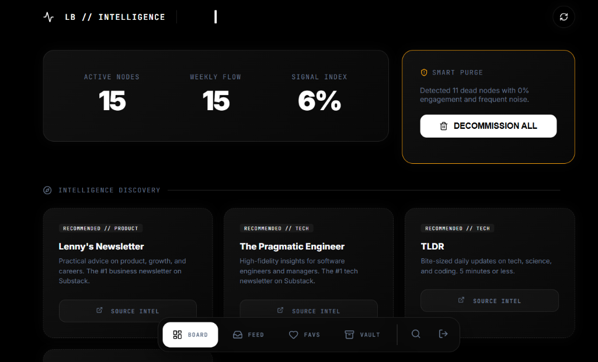
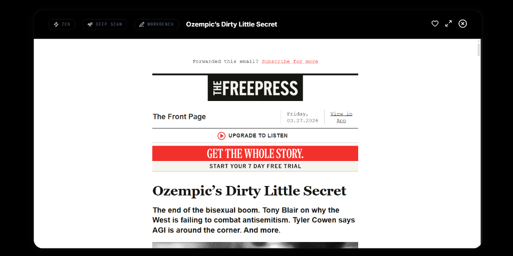
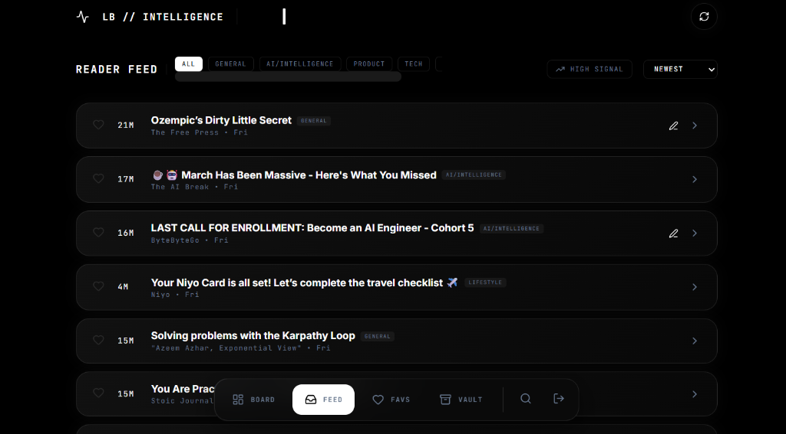

# LetterBox | Intelligence Command Center 🛰️

**Stop reading newsletters. Start capturing intelligence.**

LetterBox is a high-performance, local-first dashboard designed for the information-heavy digital age. It transforms your cluttered Gmail inbox into a tactical feed, using automated extraction and rich-text workbench features to turn content into actionable insights.



## 📡 The Vision
We live in an era of information overload. LetterBox was built to solve this by providing a "Premium Void" experience—a distraction-free, high-fidelity environment where you can process, analyze, and archive newsletters with surgical precision.

## 🛠️ Key Tactical Features

### 🧠 The Tactical Workbench
Our most powerful feature. It’s not just a notes app; it’s a briefing builder.
*   **Visual Capture**: Copy and paste images/screenshots directly into your notes.
*   **Signal Highlighting**: Mark critical data points with the built-in hiliting engine.
*   **Sketch Overlay**: Need to map out a connection? Use **Doodle Mode** to draw directly on your briefing.
*   **Auto-Extraction**: LetterBox automatically pulls major points from every newsletter the moment you open it.



### 📊 Intelligence Dashboard
Stay on top of your information flow with real-time metrics.
*   **Signal Index**: Track your engagement levels across all "Active Nodes" (senders).
*   **Smart Purge**: Automatically identify and decommission "Dead Nodes"—newsletters you never read that are just taking up space.
*   **Pulse Graph**: A visual heatmap of your information intake over the last 7 days.

### 🕵️ Global Search & Retrieval
Find anything instantly. The integrated search engine scans subjects, senders, and content across your entire local "Vault."



---

## 🏗️ Technology Stack
*   **Frontend**: React 19 + Vite + TypeScript (Type-safe briefings).
*   **Animation**: Framer Motion (Smooth tactical transitions).
*   **Icons**: Lucide React (Clean, functional iconography).
*   **Database**: IndexedDB (Native browser storage for ultra-fast, offline-first access).
*   **API**: Secure Gmail OAuth 2.0 Integration.

---

## 🚀 Getting Started

### Local Setup
1. **Clone the Repo**:
   ```bash
   git clone https://github.com/annamalai2912/LetterBox.git
   cd LetterBox
   ```
2. **Install Intel**:
   ```bash
   npm install
   ```
3. **Configure Environment**:
   Create a `.env` file in the root and add your Google Client ID:
   ```env
   VITE_GOOGLE_CLIENT_ID=your_google_client_id_here
   ```
4. **Boot the System**:
   ```bash
   npm run dev
   ```

---

## 🛡️ Privacy First
LetterBox is **local-first**. All your newsletters, notes, and sketches stay in your browser's `IndexedDB`. No data is sent to our servers. Your intelligence is *your* intelligence.

---

**Built for the curious. Designed for the focused.**
[Deploy to Vercel](https://vercel.com/new/clone?repository-url=https%3A%2F%2Fgithub.com%2Fannamalai2912%2FLetterBox)
